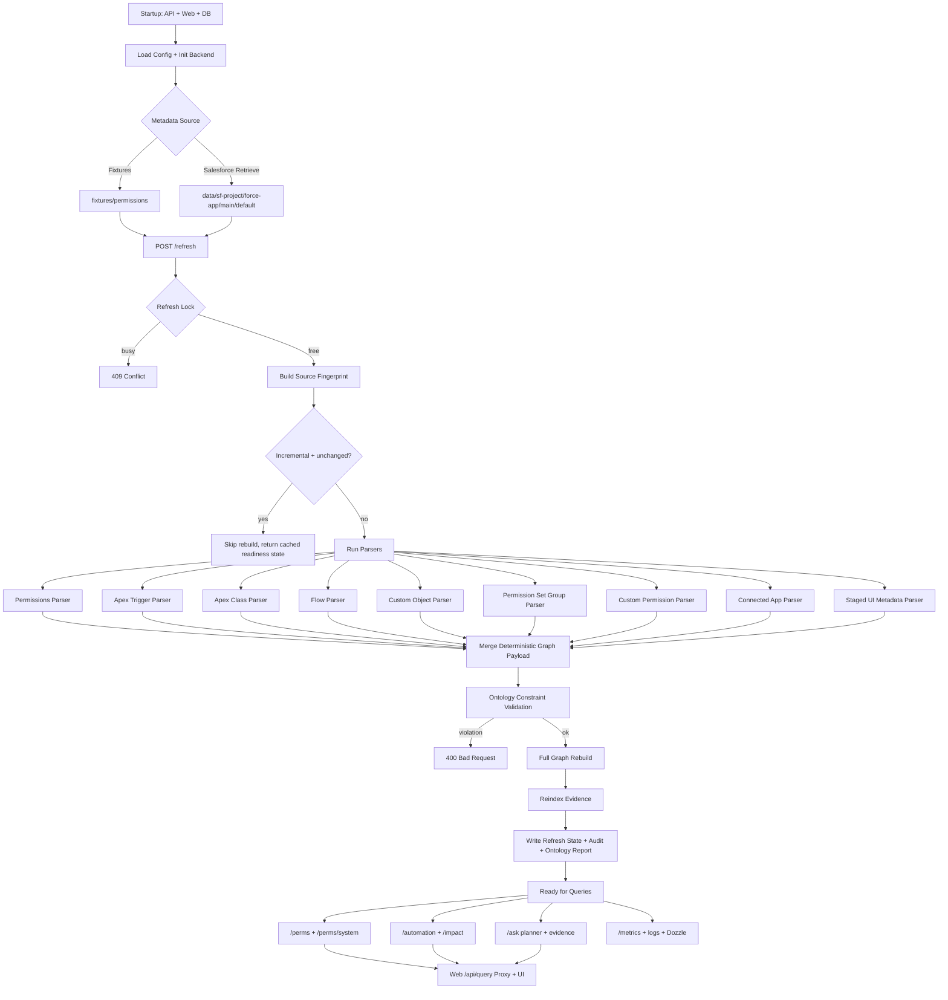
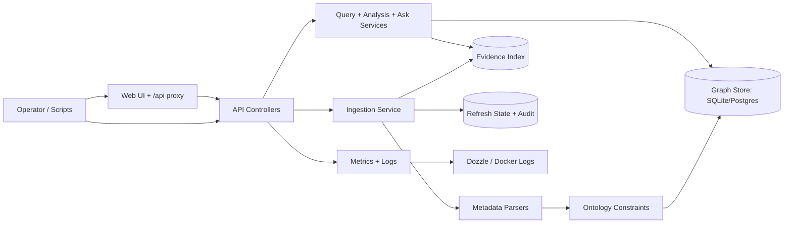

# OrgGraph Lifecycle

This document describes how OrgGraph works end-to-end, from startup through retrieval, ingestion, graph rebuild, query serving, and operations.

## 1. Startup and Configuration
- API loads environment configuration (`GRAPH_BACKEND`, data paths, Salesforce auth settings, logging flags).
- API initializes graph backend (`sqlite` or `postgres`) and ensures schema/tables exist.
- Web starts as an operator UI/proxy over API.
- Health and readiness endpoints come online.

## 2. Metadata Source Setup
- OrgGraph reads metadata from either:
  - fixture path (`fixtures/permissions`) for controlled testing, or
  - retrieved Salesforce source (`data/sf-project/force-app/main/default`) for sandbox/live usage.
- `manifest/package.xml` defines metadata types retrieved from Salesforce.

## 3. Salesforce Retrieval (Optional but Typical)
- Auth flow is established (SFDX URL, OAuth refresh token, or JWT mode).
- Retrieve command pulls metadata into `SF_PROJECT_PATH`.
- Retrieve-refresh pipeline can then trigger API refresh to rebuild graph from latest source.

## 4. Refresh Trigger
- Refresh starts via:
  - `POST /refresh`, or
  - script pipeline (for example `sf:retrieve-refresh`).
- Refresh mode:
  - `full`: always rebuild graph.
  - `incremental`: skip rebuild if source fingerprint unchanged and graph/evidence are already valid.
- Concurrency guard: if one refresh is already running, another returns `409 Conflict`.

## 5. Parse and Extract
- Parsers scan metadata and emit deterministic graph pieces:
  - permissions parser
  - apex trigger parser
  - apex class parser
  - flow parser
  - custom object parser
  - permission set group parser
  - custom permission parser
  - connected app parser
  - staged UI metadata parser (feature gated by `INGEST_UI_METADATA_ENABLED=true`)
- Output from each parser:
  - nodes
  - edges
  - parser stats

## 6. Merge and Normalize
- Parser outputs are merged into a single graph payload.
- Node/edge IDs are deterministic.
- Payload is sorted to preserve deterministic behavior across runs.

## 7. Ontology Validation
- Merged payload is validated against ontology constraints.
- On violations, refresh fails with explicit validation error.
- On success, ontology report is written to disk for auditability.

## 8. Graph Rebuild
- Graph backend executes a full rebuild transaction:
  - clear existing graph records
  - insert nodes
  - insert edges
- Returns node/edge counts for run summary.

## 9. Evidence Reindex
- Evidence store reindexes source files and snippets.
- Writes evidence index and updates evidence count.

## 10. State and Audit Persistence
- Refresh state file is updated with:
  - source path
  - fingerprint
  - parser stats
  - counts
  - ontology summary
  - mode and timestamp
- Audit log appends run summary for historical trace.

## 11. Query Serving
- Query endpoints operate on graph + evidence:
  - `/perms`
  - `/perms/system`
  - `/automation`
  - `/impact`
  - `/ask`
- Phase 11 additions for deterministic traceability:
  - `/ask/proof/:proofId` (proof artifact lookup)
  - `/ask/replay` (deterministic replay check by replay token/proof id)
- `/ask` uses planner/orchestration but remains grounded in deterministic graph results and evidence citations.

## 12. Web Operator Layer
- Web UI posts to `/api/query` proxy.
- Proxy maps UI actions to API endpoints and returns wrapped JSON.
- Readiness panel shows upstream API readiness payload.
- Build badge identifies deployed UI revision.

## 13. Observability and Operations
- Metrics interceptor records route status and latency.
- `/metrics` exposes request metrics and DB backend.
- Logging supports detailed Dozzle visibility with reduced readiness-noise filtering.
- `/ready` reports the active fixtures path for the current runtime context and ignores stale cross-runtime state paths.
- Docker healthchecks keep services supervised.

## 14. Iteration Loop
- Retrieve latest metadata.
- Refresh graph/evidence.
- Run smoke queries.
- Inspect logs/metrics.
- Refine ontology/parser/query behavior.
- Repeat per phase/PR cycle.

## Visual: End-to-End Flow

## Visual: Runtime Components

