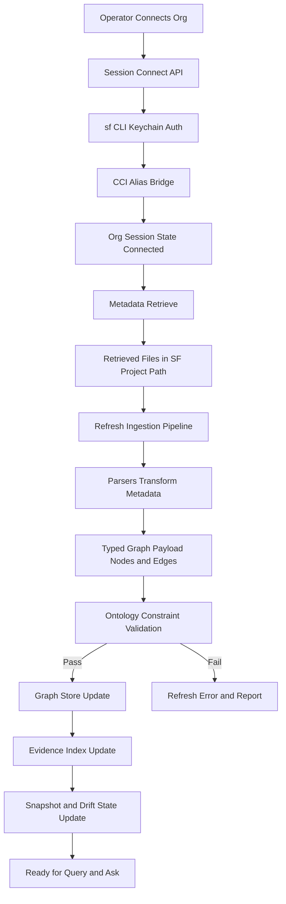
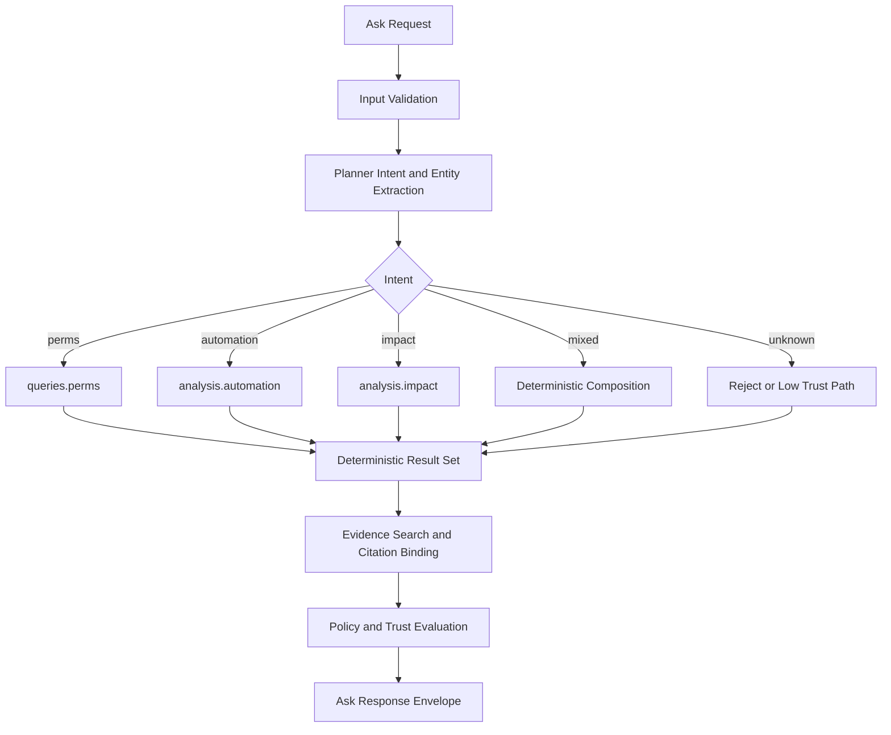
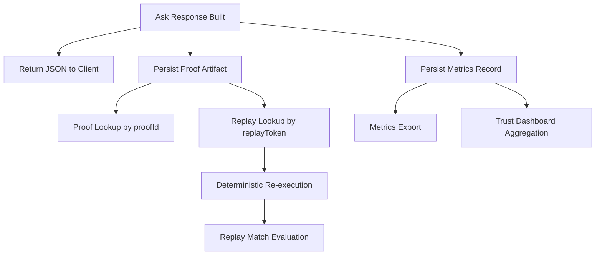

# Orgumented Data Lifecycle

This document maps how org data moves through Orgumented and how Ask answers are produced, persisted, and replayed.

## 1) End-to-End Runtime Flow



## 2) Retrieval Paths

```mermaid
flowchart LR
    A[Retrieve Trigger] --> B{Mode}
    B --> C[Org Retrieve Pipeline]
    B --> D[Selective Metadata Retrieve]
    B --> E[Local Refresh Only]

    C --> C1[/org/retrieve]
    C1 --> C2[sf project retrieve start]
    C2 --> C3[data/sf-project/force-app/main/default]

    D --> D1[/org/metadata/catalog]
    D --> D2[/org/metadata/members]
    D --> D3[/org/metadata/retrieve]
    D3 --> C3

    E --> E1[/refresh with fixturesPath]
    E1 --> E2[Parse Existing Local Metadata]
```

## 3) Ask Determination Flow



## 4) Answer and Proof Lifecycle



## 5) State Artifacts

- Runtime session state: connected or disconnected alias.
- Retrieved metadata tree: Salesforce project parse path.
- Graph state: typed nodes and edges in configured graph backend.
- Evidence index: source snippets and references used by Ask.
- Snapshot and drift state: refresh output and semantic delta metadata.
- Proof store: immutable Ask proof records with replay tokens.
- Metrics store: trust, policy, provider, and performance records.

## 6) Determinism Contract

For a fixed snapshot, policy, and query:

1. Planner emits the same intent and plan.
2. Deterministic graph calls produce the same core result.
3. Proof replay should match prior result payload semantics.
4. Any mismatch is surfaced as replay non-match, not hidden.
