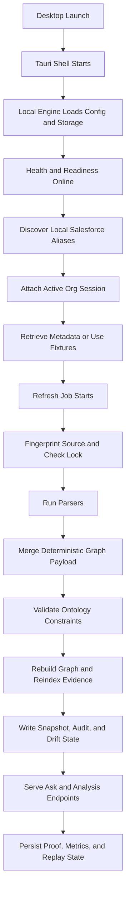
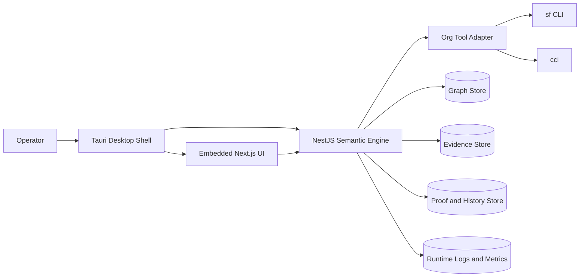

# Orgumented Lifecycle

This is the canonical lifecycle document for Orgumented. It describes how the desktop product starts, attaches to a Salesforce org, ingests metadata, produces deterministic answers, and preserves proof and replay state.

## 1. Runtime Composition
- Tauri owns the desktop window and native process boundary.
- Next.js provides the embedded operator UI inside the desktop shell.
- NestJS provides the local semantic engine and API surface.
- Local tooling is explicit: `sf` is the authentication source of truth and `cci` is support tooling.
- Local persistence stores graph state, evidence, proofs, history, and logs on the operator machine.

## 2. Startup and Health
- Desktop startup launches the shell plus the local runtime services it depends on.
- The engine loads explicit config for graph backend, data paths, logging, and org-session defaults.
- The configured graph backend initializes schema and storage paths.
- Health surfaces come online:
  - `/health`
  - `/ready`
  - `/metrics`
  - `/org/status`

## 3. Org Session Lifecycle
- The operator authenticates once through Salesforce CLI keychain:
  - `sf org login web --alias <alias> --instance-url <url> --set-default`
- Orgumented discovers available aliases from the local machine.
- Alias validation uses `sf org display --target-org <alias> --json`.
- Session attach stores the active alias in Orgumented runtime state.
- `cci` can enrich org tooling workflows, but `sf` keychain auth is the attach requirement.

## 4. Metadata Retrieval Lifecycle
- Retrieval is selector-driven, not manifest-driven.
- The active alias is used to retrieve metadata into the Salesforce project path.
- Standard sources are:
  - fixtures for deterministic local testing
  - retrieved Salesforce source for real-org workflows
- Retrieve and refresh can be run separately or as a single managed sequence.

## 5. Refresh and Ingestion Lifecycle
- Refresh starts from `POST /refresh` or from a runtime-managed retrieve-and-refresh flow.
- A concurrency guard prevents overlapping refresh jobs.
- The engine fingerprints the source path before work begins.
- Incremental refresh can short-circuit when the source fingerprint is unchanged and valid state already exists.

## 6. Parse and Normalize Lifecycle
- Parsers scan the active metadata source and emit deterministic graph fragments.
- Current parser set includes:
  - permissions
  - Apex triggers
  - Apex classes
  - flows
  - custom objects
  - permission set groups
  - custom permissions
  - connected apps
  - staged UI metadata when enabled
- Outputs are merged into one deterministic payload.
- Node IDs, edge IDs, and ordering are normalized so repeated runs on the same input produce the same graph payload.

## 7. Constraint and Storage Lifecycle
- The merged payload is validated against ontology constraints before storage writes.
- Validation failures stop the refresh and surface explicit errors.
- Successful refresh writes:
  - graph nodes and edges
  - ontology report
  - evidence index
  - refresh state
  - semantic snapshot and drift summary
  - append-only audit history

## 8. Query and Ask Lifecycle
- Deterministic engine endpoints operate directly on graph and evidence state:
  - `/perms`
  - `/perms/system`
  - `/automation`
  - `/impact`
  - `/ask`
- `/ask` compiles a deterministic plan, executes graph/evidence lookups, applies policy gates, and returns a proof-backed answer envelope.
- Every supported Ask answer is expected to carry a trust result, proof context, and evidence references.

## 9. Proof and Replay Lifecycle
- Ask writes immutable proof artifacts for completed responses.
- Proof lookup exposes prior decisions by `proofId`.
- Replay re-executes the deterministic portion of a prior decision under the recorded snapshot and policy envelope.
- Replay mismatch is surfaced explicitly; there is no hidden fallback path.
- Metrics and proof history are persisted for operator review and regression verification.

## 10. Operator Workflow Loop
- Attach or switch the active org session.
- Retrieve or refresh metadata.
- Rebuild graph and evidence state.
- Ask a question or run focused analysis.
- Inspect proof, replay, trust, and follow-up actions.
- Repeat on the next snapshot or change proposal.

## 11. Determinism Contract
For the same snapshot, policy, and query:
1. the planner emits the same execution intent,
2. graph and evidence queries produce the same deterministic core payload,
3. proof artifacts remain derivation-traceable,
4. replay either matches or fails explicitly.

## Visual: Runtime Flow

## Visual: Product Components

