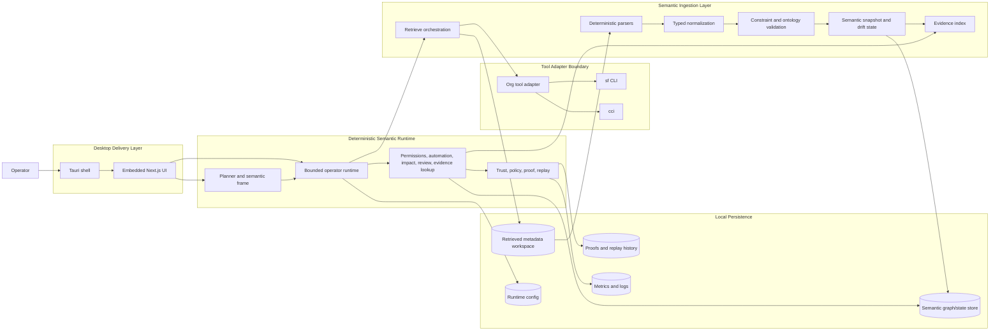
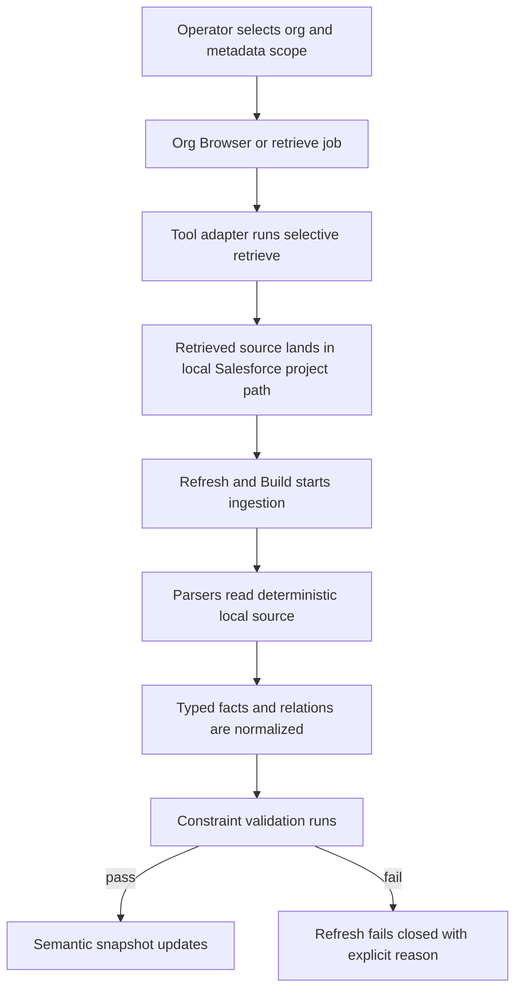
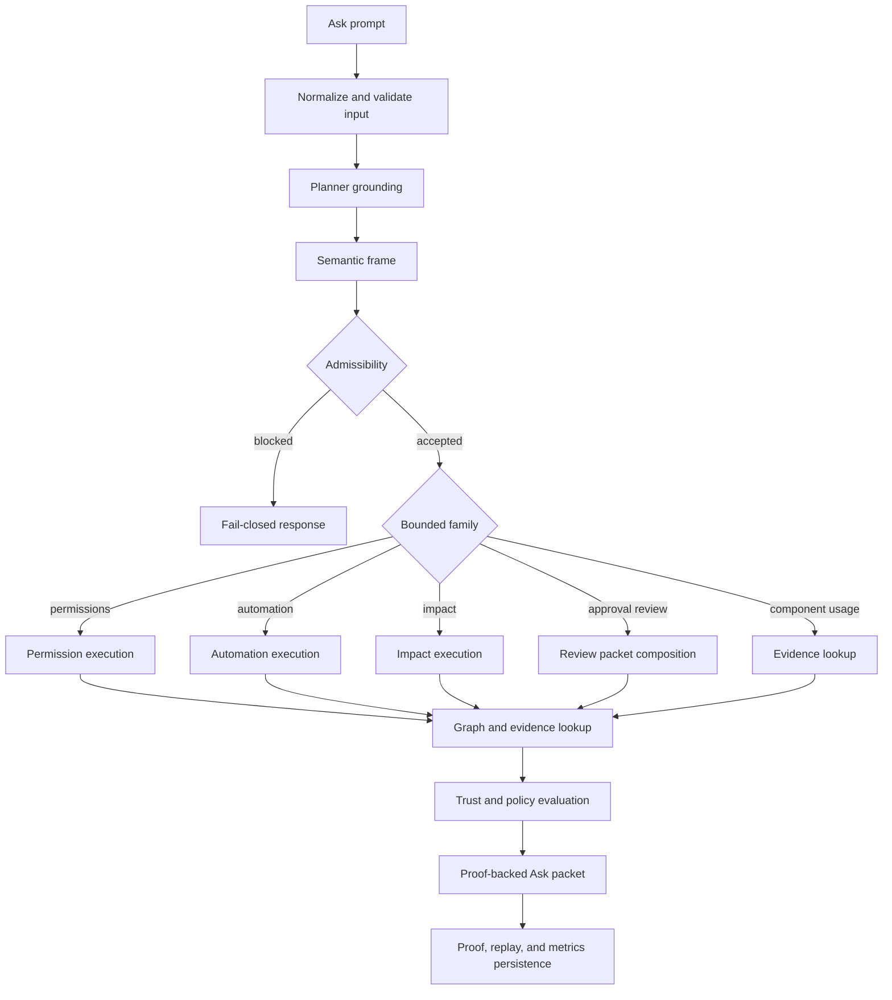

# Orgumented Data Lifecycle

This document describes the agreed Orgumented architecture in lifecycle form.

It is not just a UI walkthrough. It treats Orgumented as a deterministic semantic runtime with a desktop delivery shell around it.

Use alongside:
- `docs/planning/v2/ORGUMENTED_V2_ARCHITECTURE.md` for the canonical current runtime rules
- `docs/architecture/ORGUMENTED_LIFECYCLE.md` for the shorter product/operator lifecycle

## 1) Agreed Architectural Shape

The long-standing architecture is:

1. `Desktop delivery layer`
- Windows-native Tauri shell
- embedded Next.js operator UI

2. `Deterministic semantic runtime`
- local NestJS engine
- deterministic planners and bounded execution paths
- constraint-first, fail-closed behavior

3. `Tool boundary`
- explicit adapter around `sf` and `cci`
- no product logic leaked into raw CLI handling

4. `Semantic state and proof layer`
- typed semantic facts, relations, snapshots, evidence, proofs, replay artifacts, metrics, and logs

The product shell exists to expose the runtime. The runtime is the product moat.

## 2) Full Architecture Map

## 3) Runtime Ownership Lifecycle

Orgumented runs through three concentric ownership boundaries:

1. `Tauri shell`
- starts the desktop application
- owns the native window and packaged process lifecycle
- starts and supervises the local runtime boundary

2. `Embedded UI`
- renders the operator workspaces
- owns navigation and local workflow state
- never owns policy or decision logic

3. `Semantic engine`
- owns all business logic:
  - planning
  - normalization
  - analysis
  - policy and trust
  - proof generation
  - replay

Lifecycle rule:
- the UI may request
- the engine must decide

## 4) Tool Boundary Lifecycle

The tool boundary is the bridge from the semantic runtime to the local Salesforce environment.

Lifecycle:

1. Discover local aliases and tool versions.
2. Validate `sf` availability and session state.
3. Validate `cci` availability where support tooling is required.
4. Normalize raw CLI output into typed internal contracts.
5. Classify operator-visible failure states.

Hard rule:
- raw `sf` and `cci` behavior is not allowed to leak directly into the UI or planner semantics

## 5) Metadata Ingress Lifecycle

This is the entry path from org metadata into the semantic runtime.

Ingress stages:

1. `Selection`
- operator chooses scope in `Org Browser`

2. `Retrieval`
- tool adapter resolves metadata selections into retrieve arguments

3. `Parse path handoff`
- retrieved source lands in the local Salesforce project path

4. `Ingestion`
- `Refresh & Build` reads the current local source tree

5. `Normalization`
- parsers emit deterministic semantic payloads

6. `Constraint gate`
- invalid payloads block storage writes

7. `Snapshot update`
- valid payloads become the new semantic state

## 6) Semantic Normalization Lifecycle

This is the core data-model lifecycle inside the runtime.

Lifecycle:

1. Parse retrieved metadata into typed intermediate structures.
2. Normalize identifiers, ordering, and derivation references.
3. Build deterministic semantic facts and relations.
4. Attach provenance:
- source file/path
- parser version
- snapshot/rebuild context
5. Validate ontology and invariant rules.
6. Emit a storage-safe semantic payload.

The runtime goal is not “parsed XML exists.” The goal is:
- typed semantic state
- stable derivation relationships
- replay-safe provenance

## 7) Semantic Snapshot and Drift Lifecycle

After normalization, the runtime updates semantic state rather than just raw file state.

Lifecycle:

1. Compare the incoming payload to the current semantic state.
2. Compute refresh counts, semantic deltas, and drift indicators.
3. Write the new semantic snapshot when validation succeeds.
4. Persist drift summaries for later comparison and review.
5. Keep enough evidence and provenance to explain why a snapshot changed.

This is why Orgumented is a semantic runtime rather than a metadata viewer.

## 8) Ask Lifecycle

`Ask` is the flagship surface, but it sits on top of the runtime layers above.

Lifecycle:

1. Receive a bounded natural-language prompt.
2. Validate and normalize the prompt.
3. Ground the prompt into a deterministic semantic frame:
- intent
- target
- source mode
- admissibility
4. If the frame blocks, fail closed with an explicit reason.
5. If accepted, dispatch into the bounded execution path.
6. Pull graph/evidence state from the current semantic snapshot.
7. Compose a deterministic response packet.
8. Bind citations, trust, proof, and replay context.
9. Return the packet to the UI and persist proof artifacts.

Current bounded Ask families:
- permissions
- automation
- impact
- approval review
- metadata component usage lookup

## 9) Ask Determination Flow

## 10) Explain & Analyze Lifecycle

`Explain & Analyze` is the direct deterministic inspection surface.

Lifecycle:

1. Accept explicit structured inputs:
- user
- object
- field
- system permission
- analysis mode
2. Dispatch directly into bounded engine endpoints.
3. Return readable structured cards instead of raw payloads by default.
4. Support handoffs back into Ask, Browser, or Refresh when recovery or follow-up is needed.

This surface is intentionally less interpretive than Ask.
It is the direct inspection layer over the same semantic snapshot.

## 11) Proof, Replay, and Trust Lifecycle

Proof and replay are not post-processing extras. They are part of the runtime contract.

Lifecycle:

1. A deterministic response packet is produced.
2. The runtime writes:
- proof artifact
- replay contract
- trust envelope
- metrics record
3. `Proofs & History` exposes label-first access to prior artifacts.
4. Replay re-executes the deterministic path under recorded context.
5. Any mismatch is surfaced explicitly.
6. Metrics and trust dashboards aggregate these outcomes for operator inspection.

Hard rule:
- no response should become “trusted” without a derivation-traceable proof path

## 12) Workspace Overlay Lifecycle

The desktop workspaces are the operator-facing projection of the underlying runtime.

### Ask
- natural-language decision surface over the semantic runtime

### Org Sessions
- alias discovery, validation, attach, switch, and session recovery

### Org Browser
- metadata discovery, family expansion, checked selection cart, selective retrieve handoff

### Refresh & Build
- parse-path ingestion, rebuild, snapshot update, and drift comparison

### Explain & Analyze
- structured deterministic analysis cards

### Proofs & History
- label-first proof inspection, replay, and artifact export

### Settings & Diagnostics
- runtime health, readiness, tool state, Ask trust telemetry, and operator recovery actions

These are product surfaces. They are not the architecture itself.
They sit on top of the runtime architecture already described.

## 13) Local Persistence Lifecycle

The runtime persists several different classes of state:

1. `Retrieved metadata`
- local Salesforce project source used by refresh

2. `Semantic state`
- graph, facts, relations, and snapshot records

3. `Evidence state`
- citations and source fragments used in Ask and analysis

4. `Proof state`
- proof artifacts, replay artifacts, history labels

5. `Metrics and logs`
- trust metrics, runtime diagnostics, export artifacts, audit surfaces

6. `Runtime config`
- explicit local config and path state

Security rule:
- Orgumented persists runtime state, not Salesforce secrets
- Salesforce authentication stays in the local CLI/keychain boundary

## 14) Determinism and Failure Contract

For the same snapshot, query, and policy envelope:

1. the planner must ground to the same bounded execution path
2. graph and evidence reads must produce the same core result
3. proof artifacts must remain derivation-traceable
4. replay must match or fail explicitly
5. invalid reasoning paths must fail closed
6. no workspace may silently widen from constrained mode to unconstrained mode

That contract applies to:
- retrieval
- ingestion
- analysis
- Ask
- proof
- replay
- diagnostics

If Orgumented cannot preserve that contract, it must stop and say why.
