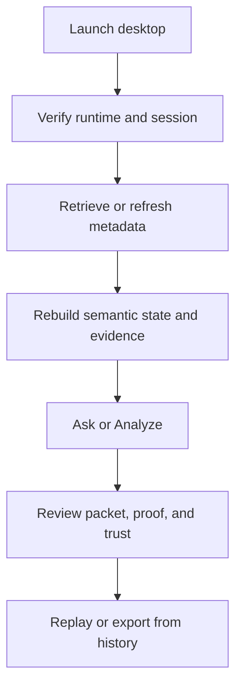
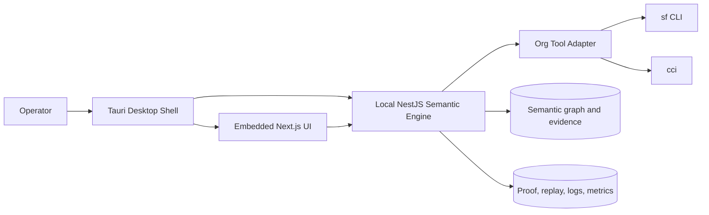

# Orgumented Lifecycle Overview

This is the short visual lifecycle overview.

For the detailed agreed architecture and lifecycle, use:
- [ORGUMENTED_DATA_LIFECYCLE.md](./ORGUMENTED_DATA_LIFECYCLE.md)
- [ORGUMENTED_V2_ARCHITECTURE.md](../planning/v2/ORGUMENTED_V2_ARCHITECTURE.md)

## Runtime Shape

- `Tauri` owns the desktop shell and packaged lifecycle.
- `Next.js` renders the operator workspaces.
- `NestJS` owns planning, analysis, proof, replay, and policy logic.
- `sf` remains the auth source of truth.
- `cci` remains support tooling behind the engine-side adapter boundary.

## Operator Loop

1. start desktop runtime
2. attach or switch org session
3. retrieve or refresh metadata
4. rebuild semantic state and evidence
5. Ask or Analyze
6. inspect proof, replay, and history

## Visual: Operator Workflow

## Visual: Product Components

## Rule

This file is intentionally brief.
Do not re-expand it into a second full architecture spec.

Detailed lifecycle belongs in:
- [ORGUMENTED_DATA_LIFECYCLE.md](./ORGUMENTED_DATA_LIFECYCLE.md)
