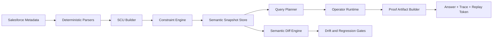
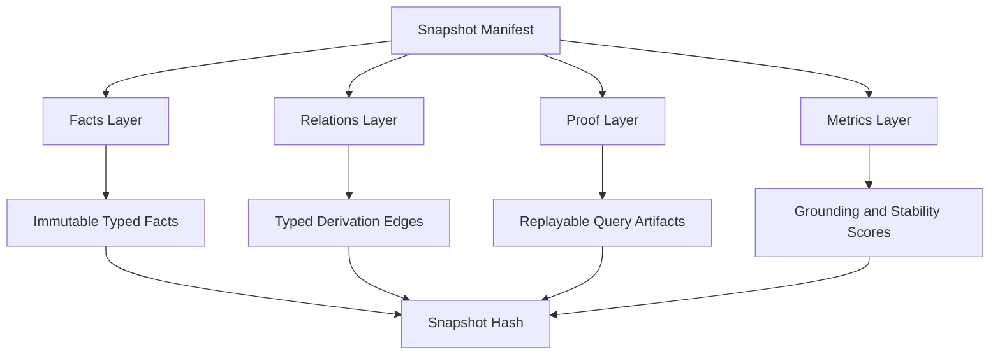
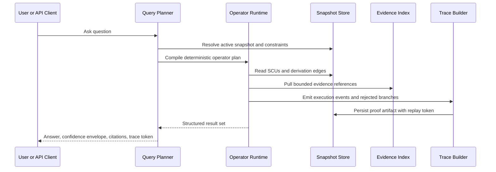
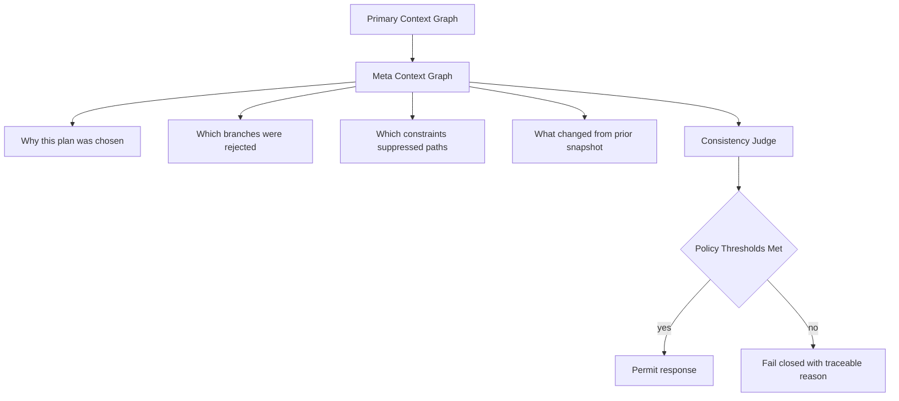
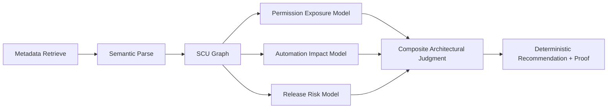

# OrgGraph Blue Ocean Execution Plan

## Objective
Build OrgGraph into a deterministic semantic runtime for Salesforce architecture decisions, where every answer is replayable, auditable, and composition-first.

## What Makes This Different
- Context is a typed runtime system, not a token retrieval bundle.
- Answers are proof artifacts, not just strings.
- Meaning is modeled as constrained composition over semantic units.
- Semantic drift is measured and blocked before trust is lost.

Language standard: use canonical terms defined in `docs/planning/ORGGRAPH_LEXICON.md`.

## Non-Negotiable Product Laws
- Deterministic by default: same snapshot + same query + same policy = same result.
- Provenance-complete: each claim must map to derivation edges and evidence IDs.
- Constraint-first: invalid reasoning paths must fail closed.
- Snapshot-grounded: each result binds to a semantic snapshot hash.
- Operator-governed: composition happens only through explicit typed operators.

## Core Abstractions

### SCU (Semantic Context Unit)
Each SCU is a typed, composable semantic atom:
- `id`: content-addressed hash over normalized payload.
- `type`: `permission`, `object`, `field`, `automation`, `policy`, `risk`, `meta`.
- `payload`: canonical typed content.
- `invariants`: constraints that must always hold.
- `provenance`: source files, parser version, snapshot ID.
- `confidence_policy`: deterministic acceptance thresholds.
- `dependencies`: required SCUs.

### Composition Operators
- `overlay(a,b)`: apply b priority semantics onto a.
- `intersect(a,b)`: keep only mutually valid constraints/claims.
- `constrain(a,c)`: restrict a by explicit policy/context c.
- `specialize(a,s)`: bind generic semantic unit to scoped context.
- `supersede(old,new)`: versioned replacement with invalidation edge.

### Derivation Relations
- `DERIVED_FROM`
- `SUPPORTS`
- `CONTRADICTS`
- `REQUIRES`
- `INVALIDATED_BY`
- `SUPERSEDES`

## Architecture Map

## Semantic Snapshot Store

## Runtime Lifecycle

## Meta-Context and Meta-Reasoning Layer

## Meaning Quantification Model

The runtime must score every response with deterministic metrics:
- `grounding_score`: claim coverage by valid derivation chain.
- `constraint_satisfaction`: percent of operator steps respecting invariants.
- `ambiguity_score`: competing interpretations after constraints.
- `stability_score`: output consistency across replay runs.
- `delta_novelty`: semantic distance from previous snapshot output.
- `risk_surface_score`: weighted impact breadth over permissions + automation.

Policy gates:
- hard deny when grounding or constraints are below threshold.
- soft warn when ambiguity exceeds threshold.
- enforce replay success before marking response as trusted.

## Salesforce-Specific Differentiator

This makes OrgGraph a decision runtime for:
- permission blast radius,
- automation side effects,
- release-time semantic regressions,
- policy compliance proofs for auditors and architects.

## Holograph-Inspired but Practical
Adopt these ideas now:
- content-addressed semantic units,
- layered composition operators,
- cryptographic snapshot grounding,
- deterministic replay artifacts.

Delay these until lift is proven:
- custom low-level storage engine rewrite,
- non-essential compressed format inventions,
- speculative runtime micro-optimizations.

## Blue Ocean Validation Program

### Benchmark Scenarios
- Scenario 1: Permission change impact across profile and permission set graph.
- Scenario 2: Automation collision risk for object and field changes.
- Scenario 3: Deployment readiness under policy and dependency constraints.

### Lift Criteria
- higher decision precision versus current endpoint-only flow.
- reproducible answers at 100 percent replay pass for benchmark set.
- lower mean time to trusted decision for architects.
- lower false positive risk alerts under real sandbox metadata.

Execution control reference:
- `docs/planning/SUCCESS_GATES_CHECKLIST.md`

## Minimal Build Order
1. Lock SCU schema and operator contracts.
2. Add derivation relation persistence and proof artifacts.
3. Add deterministic metric scoring and policy gates.
4. Add semantic diff and drift regression checks.
5. Add one flagship workflow proving measurable lift.

## Risk Controls
- No silent fallback from constrained mode to unconstrained mode.
- No response marked trusted without proof artifact.
- No operator added without deterministic property tests.
- No rollout when drift metrics regress beyond thresholds.

## Definition of Success
OrgGraph becomes the system where Salesforce architects do not ask:
"What document should I read?"
They ask:
"What is the replayable semantic proof for this architectural decision, under this snapshot and policy?"

## WebUI-First Operating Constraints
- WebUI is the primary operator surface for auth, retrieval, refresh, analysis, and proof inspection.
- Authentication path should be CCI-driven in primary UX (pin CumulusCI to `3.78.0`).
- Metadata retrieval UX should be org-wide and selective (VS Code Org Browser style), not package.xml-all by default.
- Ask UX should layer outputs:
  - deterministic evidence summary first
  - optional conversational elaboration second
