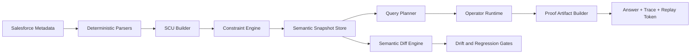
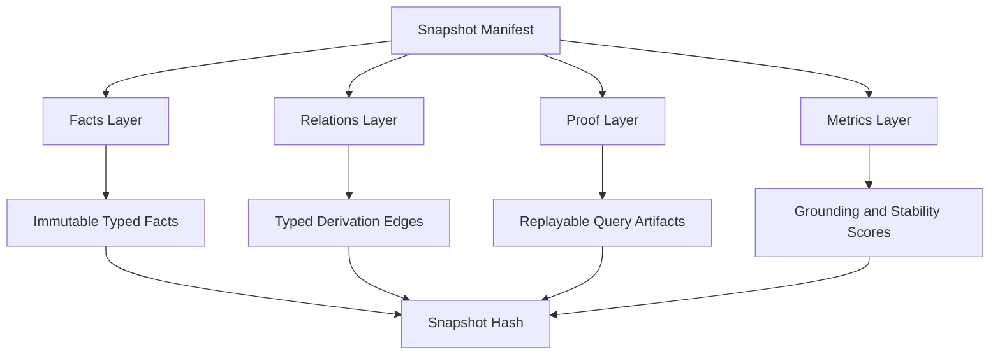
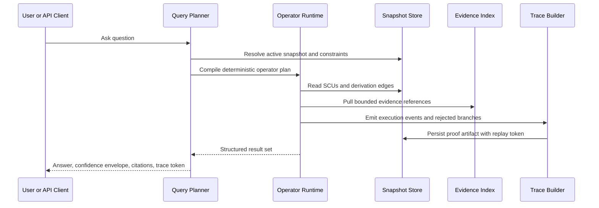
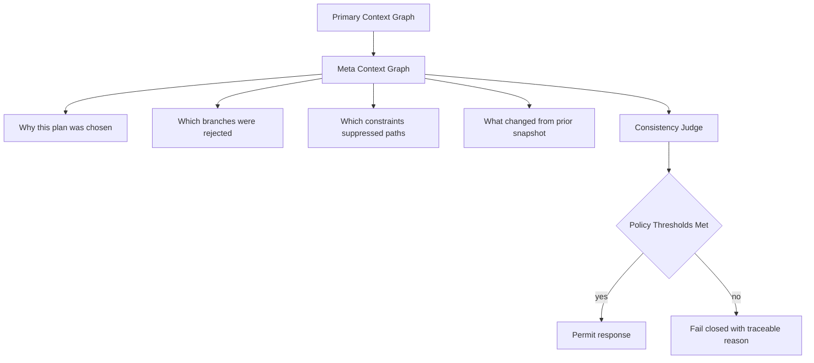
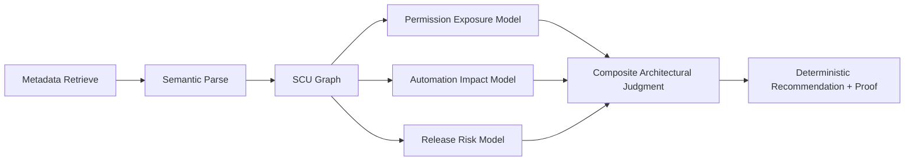

# Orgumented Blue Ocean Execution Plan

## Objective
Build Orgumented into a deterministic semantic runtime for Salesforce architecture decisions, where every answer is replayable, auditable, and composition-first.

## What Makes This Different
- Context is a typed runtime system, not a token retrieval bundle.
- Answers are proof artifacts, not just strings.
- Meaning is modeled as constrained composition over semantic units.
- Semantic drift is measured and blocked before trust is lost.

Language standard: use canonical terms defined in `docs/planning/ORGUMENTED_LEXICON.md`.

## Non-Negotiable Product Laws
- Deterministic by default: same snapshot + same query + same policy = same result.
- Provenance-complete: each claim must map to derivation edges and evidence IDs.
- Constraint-first: invalid reasoning paths must fail closed.
- Snapshot-grounded: each result binds to a semantic snapshot hash.
- Operator-governed: composition happens only through explicit typed operators.
- Ontology-authoritative planning: Ask plan selection must be validated against ontology contracts before execution.
- No keyword-triggered execution in core Ask routing: token/phrase triggers are support signals only, never final dispatch.
- LLM boundary enforcement: LLMs may assist in wording and clarification only; deterministic plan compilation and execution remain runtime-owned.

## Core Abstractions

### SCU (Semantic Context Unit)
Each SCU is a typed, composable semantic atom:
- `id`: content-addressed hash over normalized payload.
- `type`: `permission`, `object`, `field`, `automation`, `policy`, `risk`, `meta`.
- `payload`: canonical typed content.
- `invariants`: constraints that must always hold.
- `provenance`: source files, parser version, snapshot ID.
- `confidence_policy`: deterministic acceptance thresholds.
- `dependencies`: required SCUs.

### Composition Operators
- `overlay(a,b)`: apply b priority semantics onto a.
- `intersect(a,b)`: keep only mutually valid constraints/claims.
- `constrain(a,c)`: restrict a by explicit policy/context c.
- `specialize(a,s)`: bind generic semantic unit to scoped context.
- `supersede(old,new)`: versioned replacement with invalidation edge.

### Derivation Relations
- `DERIVED_FROM`
- `SUPPORTS`
- `CONTRADICTS`
- `REQUIRES`
- `INVALIDATED_BY`
- `SUPERSEDES`

## Architecture Map

## Semantic Snapshot Store

## Runtime Lifecycle

## Meta-Context and Meta-Reasoning Layer

## Meaning Quantification Model

The runtime must score every response with deterministic metrics:
- `grounding_score`: claim coverage by valid derivation chain.
- `constraint_satisfaction`: percent of operator steps respecting invariants.
- `ambiguity_score`: competing interpretations after constraints.
- `stability_score`: output consistency across replay runs.
- `delta_novelty`: semantic distance from previous snapshot output.
- `risk_surface_score`: weighted impact breadth over permissions + automation.

Policy gates:
- hard deny when grounding or constraints are below threshold.
- soft warn when ambiguity exceeds threshold.
- enforce replay success before marking response as trusted.

## Salesforce-Specific Differentiator

This makes Orgumented a decision runtime for:
- permission blast radius,
- automation side effects,
- release-time semantic regressions,
- policy compliance proofs for auditors and architects.

## Holograph-Inspired but Practical
Adopt these ideas now:
- content-addressed semantic units,
- layered composition operators,
- cryptographic snapshot grounding,
- deterministic replay artifacts.

Delay these until lift is proven:
- custom low-level storage engine rewrite,
- non-essential compressed format inventions,
- speculative runtime micro-optimizations.

## Build-vs-Borrow Doctrine (Least Pain, Max Moat)
Build only the parts that create durable differentiation. Borrow commodity infrastructure aggressively.

Custom-build (moat):
- ontology contracts and semantic operator rules
- deterministic Ask intent compiler (NL -> typed plan -> constrained execution)
- derivation/proof packet model and replay contract
- Salesforce-specific decision semantics (permission, automation, release-risk synthesis)

Adopt/reuse (plumbing):
- auth/session mechanisms (`sf`/`cci` keychain flows)
- metadata retrieve orchestration and source sync primitives
- policy/runtime validation engines (for fail-closed enforcement)
- observability and telemetry infrastructure

Do not custom-build by default:
- generic authentication stacks
- generic parser frameworks when high-quality deterministic options exist
- broad storage rewrites before measured performance/consistency lift is proven

## Delivery Reality and Risk
If we custom-build too much too early:
- initial delivery time increases materially
- maintenance burden compounds every phase
- reliability risk rises before determinism harnesses mature

Program rule:
- no major custom subsystem lands without measurable lift criteria and rollback path
- prove value at operator workflow level before runtime re-platform decisions

## Desktop-Native Transition Rule
Orgumented is transitioning to a desktop-native product runtime.

Architecture decisions:
- desktop shell: Tauri
- operator UI: Next.js
- semantic engine: NestJS
- auth source of truth: Salesforce CLI keychain
- local orchestration tools: `sf` and `cci`

Hard rules:
- Docker is not the target product runtime.
- Docker is removed from the active runtime and should not be restored as part of the desktop product path.
- No further investment should expand browser-broker, VNC, or container-auth workarounds.
- No standard operator workflow should assume container-local paths, mounted keychains, or compose-managed sessions.

Transition references:
- `docs/planning/DESKTOP_ARCHITECTURE.md`
- `docs/planning/DESKTOP_TRANSITION_PLAN.md`
- `docs/planning/LEGACY_REMOVAL_REGISTER.md`
- `docs/planning/REUSE_REFACTOR_DELETE_MATRIX.md`
- `docs/planning/DESKTOP_UX_BLUEPRINT.md`

## Blue Ocean Validation Program

### Benchmark Scenarios
- Scenario 1: Permission change impact across profile and permission set graph.
- Scenario 2: Automation collision risk for object and field changes.
- Scenario 3: Deployment readiness under policy and dependency constraints.

### Lift Criteria
- higher decision precision versus current endpoint-only flow.
- reproducible answers at 100 percent replay pass for benchmark set.
- lower mean time to trusted decision for architects.
- lower false positive risk alerts under real sandbox metadata.

Execution control reference:
- `docs/planning/SUCCESS_GATES_CHECKLIST.md`

## Minimal Build Order
1. Lock SCU schema and operator contracts.
2. Add derivation relation persistence and proof artifacts.
3. Add deterministic metric scoring and policy gates.
4. Add semantic diff and drift regression checks.
5. Add one flagship workflow proving measurable lift.
6. Apply build-vs-borrow audits at each phase boundary (what remains custom vs adopted and why).

## Risk Controls
- No silent fallback from constrained mode to unconstrained mode.
- No response marked trusted without proof artifact.
- No operator added without deterministic property tests.
- No rollout when drift metrics regress beyond thresholds.

## Definition of Success
Orgumented becomes the system where Salesforce architects do not ask:
"What document should I read?"
They ask:
"What is the replayable semantic proof for this architectural decision, under this snapshot and policy?"

## Desktop-First Operating Constraints
- The standalone desktop app is the primary operator surface for auth, retrieval, refresh, analysis, and proof inspection.
- Authentication path should be Salesforce CLI keychain-driven in primary UX (local CLI-backed alias discovery/attach flow, alias/session contract).
- Metadata retrieval UX should be org-wide and selective (VS Code Org Browser style), not package.xml-all by default.
- Legacy manifest-driven retrieval is a removal target, not a long-term path:
  - no package.xml requirement for standard operator workflows
  - `/org/retrieve` should use explicit metadata selection contracts
  - `SF_MANIFEST_PATH` is removed from active runtime/config paths
- Ask UX should layer outputs:
  - deterministic evidence summary first
  - optional conversational elaboration second
- Embedded UI implementation rule: build a fresh operator experience; do not inherit prior endpoint-console layout/components as the base UI.
- Ask flagship requirement: Ask panel is primary surface and must return a decision packet, not raw JSON as default presentation.

## Next.js Embedded UI Architecture Standard
Current state:
- Web app runs on Next.js App Router, but implementation patterns are mixed and not consistently feature-segmented.

Target state:
- Adopt a clear Next.js-first structure with:
  - route-grouped workflows (`Ask`, `Connect`, `Retrieve`, `Refresh`, `Analyze`, `Proofs`, `System`)
  - explicit server/client boundaries per feature
  - shared design system and interaction primitives
  - predictable data access layer (typed request/response contracts, centralized API adapters)
  - testable feature modules with UI + behavior parity gates

Migration strategy:
- No big-bang rewrite mixed with backend contract churn.
- Implement a fresh UI shell and migrate workflow-by-workflow behind stable API contracts.
- Keep superseded UI paths removable once parity gates pass.

Difficulty and payoff:
- Migration difficulty: medium if incremental, high if combined with concurrent auth/runtime rewrites.
- Expected payoff: faster iteration, lower regression rate, clearer operator UX, and lower onboarding cost.

Release gate for architecture migration:
- No “operator-ready” claim unless all primary workflows run in the new structure with smoke-test parity.

## Current Execution Sequencing Update (Wave Model)
Execution is now dependency-first via waves (see `BLUE_OCEAN_PHASE_ROADMAP.md`):
1. Wave A: Operator baseline and removal work
2. Wave B: Ask deterministic core
3. Wave C: Proof productization
4. Wave D: Fresh Ask-first UX capability target
5. Wave E: Simulation/risk/commercialization
6. Wave F: Desktop foundation and runtime cutover
7. Wave G: Desktop Ask-first product UX

Planning rule:
- Legacy phase files are delivery history.
- Active planning, gating, and readiness claims must reference waves and their entry/exit criteria.

Historical phase mapping (for traceability):
- Prior phases `18-34` map into one or more of Waves A-E.
- Overlapping phase scopes are consolidated under the wave dependency chain.

Program intent:
- Move from "metadata/endpoint console" to "architecture decision operating system".
- Keep determinism and proof-first behavior as strict non-negotiables.
