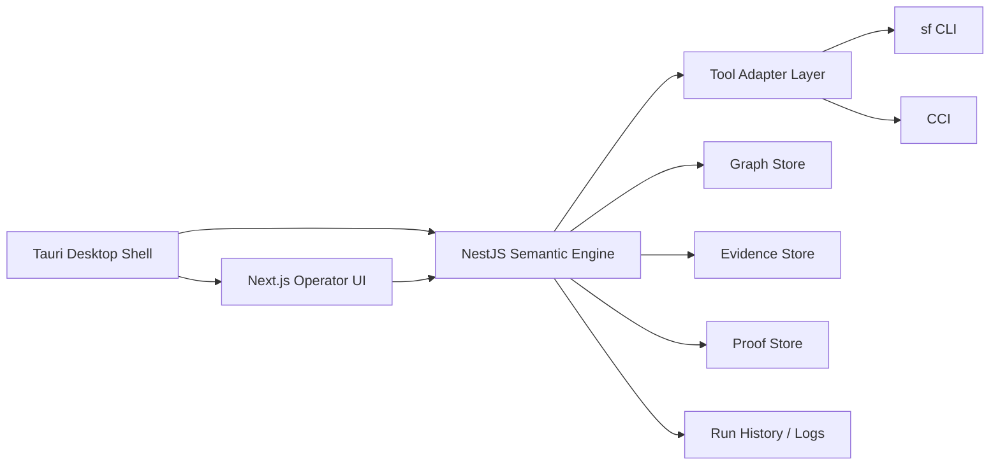

# Orgumented Desktop Architecture

Status: target-state architecture

Purpose: define the desktop-native architecture for Orgumented after retiring Docker as a product runtime.

## 1. Architectural Decision
- Product runtime: desktop-native application
- UI framework: Next.js
- backend framework: NestJS
- desktop shell: Tauri
- Salesforce auth source of truth: Salesforce CLI keychain
- supported local tooling: `sf` and `cci`
- Docker status: development-only migration scaffold, not product architecture

## 2. Product Principles
- Ask is the flagship surface.
- Every answer must remain deterministic, replayable, and proof-backed.
- Orgumented does not invent a proprietary auth system.
- Local operator workflows are primary; browser-hosted/server-hosted assumptions are secondary.
- Desktop UX must hide transport/runtime complexity from operators.

## 3. Top-Level Runtime Shape
Orgumented desktop consists of five cooperating layers:

1. Desktop shell
- Tauri application
- owns window lifecycle, menus, local settings, notifications, auto-update policy, and native OS access

2. Operator UI
- Next.js-based application rendered inside the Tauri shell
- route-grouped feature areas with Ask as the default workspace

3. Semantic engine
- NestJS backend running locally as a sidecar or managed local service
- owns ingestion, ontology validation, graph operations, proof generation, and Ask orchestration

4. Tool adapter layer
- stable internal interface around `sf` and `cci`
- responsible for alias discovery, session validation, metadata retrieve, org inspection, and command normalization

5. Local persistence layer
- app-managed local storage for graph state, evidence, proofs, config, logs, and run history

## 4. System Context

## 5. UI Architecture
Next.js remains the UI framework, but the product model changes:
- no endpoint-console layout
- no "browser app pretending to be desktop"
- feature modules organized by operator workflow

Planned top-level workspaces:
1. Ask
2. Org Sessions
3. Org Browser
4. Refresh and Build
5. Explain and Analyze
6. Proofs and Replay
7. Settings and Diagnostics

## 6. Backend Architecture
NestJS remains the semantic engine initially.

Primary module groups:
1. `auth/session`
- alias discovery
- session attach/switch/disconnect
- `sf` and `cci` validation

2. `retrieve`
- metadata type/member discovery
- selector-based retrieve jobs
- retrieve audit and operator feedback

3. `ingestion`
- parser orchestration
- ontology validation
- graph rebuild
- evidence reindex

4. `analysis`
- permissions
- automation
- impact
- simulation and release-risk, later waves

5. `ask`
- deterministic planner
- proof generation
- replay and trust metrics

6. `platform`
- settings
- diagnostics
- local paths
- logs
- tool capability detection

## 7. Auth Model
Primary rule:
- Salesforce CLI keychain is the only authentication source of truth.

Orgumented auth behavior:
1. discover local aliases via `sf org list --json`
2. validate alias via `sf org display --target-org <alias> --json`
3. validate or bridge alias into `cci`
4. attach alias to Orgumented session state

If no valid alias exists:
- Orgumented may launch a normal local CLI login flow
- browser interaction happens on the operator machine, not in a container

Not part of target architecture:
- external client app auth
- pasted access token auth
- frontdoor URL auth
- browser broker / VNC sidecars
- auth-code files

## 8. Tool Adapter Layer
The tool adapter layer is a hard boundary between Orgumented and external CLIs.

Responsibilities:
- detect tool availability and versions
- normalize command execution
- translate raw CLI output into typed internal contracts
- classify failure reasons into actionable operator states
- centralize retry, timeout, and environment handling

This layer should prevent `sf` and `cci` assumptions from spreading across UI or business logic.

## 9. Local Persistence
Recommended local app data root:
- `~/.orgumented/`

Suggested structure:
- `config/`
- `data/graph/`
- `data/evidence/`
- `data/proofs/`
- `data/retrieve/`
- `logs/`
- `history/`

Initial storage strategy:
- SQLite for local-first simplicity
- explicit abstraction boundary for later evolution if a richer storage/runtime becomes justified

## 10. Ask-Centric Response Model
Ask must not default to raw JSON.

Primary response shape:
1. decision summary
2. deterministic explanation
3. proof/trust envelope
4. evidence references
5. optional elaboration
6. follow-up actions

JSON remains available as an operator/debug view, not the default output mode.

## 11. Desktop Job Model
Long-running work should execute as managed jobs:
- alias validation
- metadata retrieve
- refresh
- rebuild
- export
- proof replay

Each job needs:
- queued/running/completed/failed state
- timestamps
- structured logs
- cancellation semantics where safe
- deterministic artifact links

## 12. Security Model
- secrets stay local to the operator environment
- Orgumented reads existing CLI/keychain state rather than storing Salesforce credentials itself
- proofs/logs must avoid secret leakage
- local config should be explicit about what is persisted and where

## 13. Non-Goals
- preserving Docker as a first-class runtime
- preserving legacy auth paths
- preserving the current endpoint-console WebUI
- building a hosted multi-tenant SaaS before local operator workflows are solved

## 14. Exit Criteria For Architecture Adoption
This architecture is considered active only when:
1. operator connects an org through local CLI-backed alias workflows
2. retrieve, refresh, and Ask all run without Docker assumptions
3. current flagship workflows execute inside the desktop shell
4. no core operator workflow requires the legacy browser-hosted WebUI
