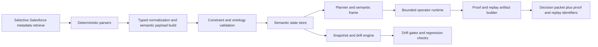
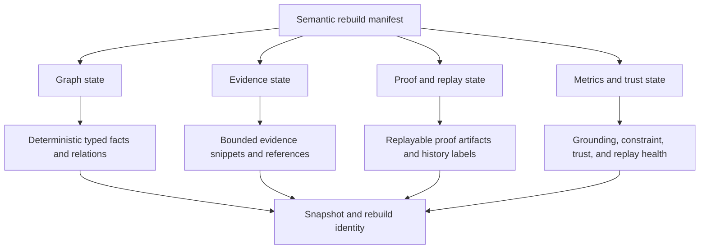
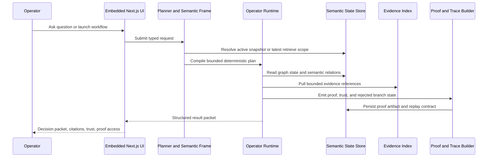
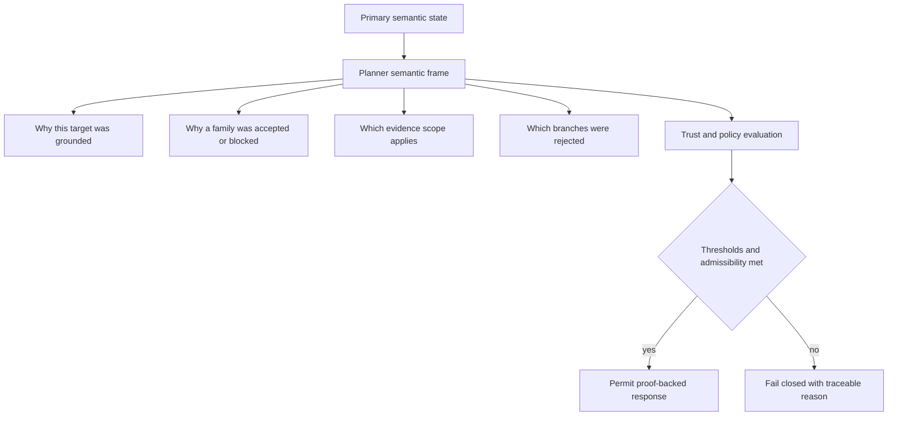
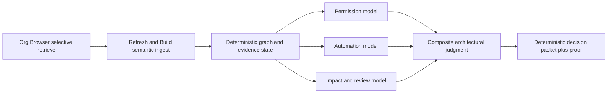

# Orgumented v2 Semantic Runtime Reference

Status:
- active supporting reference
- not a replacement for the core v2 control set

Purpose:
- preserve the deeper semantic-runtime architecture model as a live document
- keep the detailed Mermaid diagrams current with the actual desktop-first v2 architecture
- maintain a richer architectural reference than the compact v2 summaries alone

Primary control docs still remain:
- `docs/planning/v2/ORGUMENTED_V2_STRATEGY.md`
- `docs/planning/v2/ORGUMENTED_V2_ARCHITECTURE.md`
- `docs/planning/v2/ORGUMENTED_V2_ROADMAP.md`
- `docs/planning/v2/ORGUMENTED_V2_EXECUTION.md`
- `docs/planning/v2/ORGUMENTED_V2_GOVERNANCE.md`

## Objective
Build Orgumented into a deterministic semantic runtime for Salesforce architecture decisions, delivered as a Windows desktop product and proven through replayable, auditable, fail-closed decision artifacts.

Near-term product wedge:
- trusted Salesforce change-risk decisions

Long-term ambition:
- executable architecture governance

## What Still Makes This Different
- Context is a typed runtime system, not a token bundle or generic chat context.
- Answers are proof artifacts, not just strings.
- Meaning is bounded by explicit planner/runtime contracts, not unconstrained text generation.
- Semantic drift is measured and blocked before trust is lost.
- The desktop shell is only the delivery surface; the moat remains the semantic runtime.

Language standard:
- use canonical terms defined in `docs/planning/v2/ORGUMENTED_V2_LEXICON.md`

## Non-Negotiable Product Laws
- Deterministic by default: same snapshot + same query + same policy = same result.
- Provenance-complete: each claim must map to derivation edges, evidence IDs, or explicit semantic-frame grounding.
- Constraint-first: invalid reasoning paths must fail closed.
- Snapshot-grounded: each result binds to a semantic snapshot or explicit retrieve-scoped evidence mode.
- Operator-governed: composition happens only through typed runtime operators and declared workflows.
- No hidden fallback from constrained mode to unconstrained mode.
- No keyword-triggered execution in core Ask routing: text cues may assist normalization but are never final dispatch.
- LLM boundary enforcement: wording help is optional; deterministic planning and execution remain runtime-owned.
- No policy logic in the UI.

## Core Abstractions

### Semantic Runtime State
The runtime currently works through four concrete semantic state layers:
- `graph state`: deterministic nodes, edges, and derived runtime state
- `evidence state`: source snippets and references used in Ask and analysis
- `proof state`: persisted proof artifacts, replay contracts, and history labels
- `metrics state`: trust and reliability measurements over Ask executions

### SCU (Semantic Context Unit)
SCU remains the detailed semantic design vocabulary for Orgumented:
- `id`: content-addressed hash over normalized payload
- `type`: `permission`, `object`, `field`, `automation`, `policy`, `risk`, `meta`
- `payload`: canonical typed content
- `invariants`: constraints that must always hold
- `provenance`: source files, parser version, snapshot ID
- `confidence_policy`: deterministic acceptance thresholds
- `dependencies`: required SCUs

Current status:
- SCU types and composition operators exist in the ontology package
- the full product runtime is not yet universally modeled as SCU-first execution
- the current production bridge is a bounded semantic-frame planner layered over graph/evidence/proof state

### Semantic Frame
The current production planner contract is the semantic frame.

Current bounded frame families:
- `impact_analysis`
- `permission_path_explanation`
- `automation_path_explanation`
- `approval_decision`
- `evidence_lookup`

Each frame carries:
- intent
- grounded target
- source mode
- admissibility
- ambiguity state

### Composition Operators
The semantic composition model remains part of the intended moat and is partially active through proof/operator traces:
- `overlay(a,b)`
- `intersect(a,b)`
- `constrain(a,c)`
- `specialize(a,s)`
- `supersede(old,new)`

### Derivation Relations
- `DERIVED_FROM`
- `SUPPORTS`
- `CONTRADICTS`
- `REQUIRES`
- `INVALIDATED_BY`
- `SUPERSEDES`

## Architecture Map

## Semantic Snapshot Store

## Runtime Lifecycle

## Meta-Context and Meta-Reasoning Layer

## Meaning Quantification Model

The original blue-ocean metric model was broader than the current production runtime. Here is the honest current state.

Currently active in production:
- `grounding_score`
- `constraint_satisfaction`
- trust level: `trusted`, `conditional`, `refused`
- replay pass rate and proof coverage at the dashboard/reporting layer

Still design intent, not uniformly productized:
- `ambiguity_score`
- `stability_score`
- `delta_novelty`
- `risk_surface_score`

Current policy gates:
- hard deny when grounding or constraint thresholds are below policy
- explicit refusal for blocked semantic-frame states
- replay mismatch is surfaced explicitly

## Salesforce-Specific Differentiator

This still makes Orgumented a runtime for:
- permission blast radius
- automation side effects
- metadata-driven change impact
- approval/review support under a snapshot and policy envelope
- replayable architectural proof

## Current Desktop Runtime and Libraries

Current runtime stack in the repo:

### Desktop delivery
- `Tauri` shell via `@tauri-apps/cli`
- `esbuild` for packaged runtime preparation

### Embedded UI
- `Next.js 14.2.15`
- `React 18.3.1`
- `TypeScript 5.6.3`

### Local semantic engine
- `NestJS 10.4.x`
- `TypeScript`
- `rxjs`
- `reflect-metadata`

### Local storage and parsing
- `better-sqlite3` for local-first runtime state
- `pg` for secondary Postgres verification and failure-path tests
- `fast-xml-parser` for Salesforce metadata parsing

### Org tool boundary
- `sf` CLI
- `cci`

### Workspace and automation tooling
- `pnpm`
- PowerShell and Node-based repo scripts
- GitHub Actions validate/build/smoke workflow

### Domain packages
- `@orgumented/ontology`
- `@orgumented/project-memory-mcp`

## Current Semantic Runtime Posture

Still valid to keep:
- content-addressed semantic units
- layered composition operators
- snapshot-grounded proof contracts
- deterministic replay artifacts

Current reality:
- the repo implements some of this substrate
- the production architecture has intentionally stayed more pragmatic and bounded
- semantic frames are the current bridge between raw natural-language prompts and a deeper formal semantic runtime

## Build-vs-Borrow Doctrine (Least Pain, Max Moat)

Build only what creates durable differentiation.

Custom-build moat:
- Salesforce semantic judgment layer
- deterministic Ask planner and semantic-frame contract
- proof/replay packet model
- decision-packet contract
- metadata-specific reasoning over permissions, automation, impact, review, and evidence lookup

Borrow aggressively:
- desktop shell and build tooling
- UI framework
- backend framework
- XML parsing
- storage primitives
- auth/session/tooling integration through `sf` and `cci`
- CI and release automation

Do not custom-build by default:
- generic authentication stacks
- generic desktop shell infrastructure
- broad storage/runtime rewrites
- speculative parser framework churn without semantic-frame proof of value

## Delivery Reality and Risk

This is where the blue-ocean plan narrowed in practice.

Current program rule:
- prove value at operator workflow level before expanding architecture ambition

That means:
- trusted change-decision engine first
- policy-aware approval support second
- broader governance only after trust and workflow adoption are proven

This is deliberate narrowing, not accidental architectural collapse.

## Desktop-Native Runtime Rule

This is no longer a transition rule. It is the active architecture.

Active runtime decisions:
- desktop shell: `Tauri`
- operator UI: embedded `Next.js`
- semantic engine: local `NestJS`
- auth source of truth: Salesforce CLI keychain
- local orchestration tools: `sf` and `cci`

Hard rules:
- Docker is not part of runtime, release, or operator workflow
- no browser-broker, VNC, or container-auth detours
- no standard operator workflow depends on container-local paths

## Blue Ocean Validation Program

Current benchmark direction remains valid, but it is now expressed through the v2 wave plan and Stage 1 execution.

Benchmark classes that still matter:
- permission change impact
- automation collision risk
- approval-review quality
- replay and proof integrity
- real-org operator workflow proof

Lift criteria that still matter:
- higher decision precision versus raw endpoint or manual review flow
- reproducible answers under replay
- lower time-to-trusted architectural decision
- lower manual effort to gather evidence

## Minimal Build Order (Current Translation)

The original build order translates into the current v2 wave order:

1. lock runtime/session/browser/retrieve foundations
2. deepen Ask planner/compiler through semantic-frame rollout
3. improve decision-packet quality
4. close structured Explain/Analyze and proof/history workflows
5. harden accessibility, regression coverage, and release proof

Current active execution source:
- `docs/planning/v2/ORGUMENTED_V2_EXECUTION.md`

## Risk Controls
- no silent fallback from constrained mode to unconstrained mode
- no trusted response without proof and trust context
- no planner-family expansion without replay-safe tests
- no packaged-runtime claim without desktop smoke evidence
- no release readiness claim without operator proof and rollback evidence

## Definition of Success

Orgumented becomes the system where Salesforce architects do not ask:
"What document should I read?"

They ask:
"What is the replayable semantic proof for this change decision under this snapshot and policy?"

And the product can answer that through:
- desktop-native operator workflow
- deterministic bounded planning
- evidence-backed decision packets
- persisted proof and replay

## Desktop-First Operating Constraints
- The packaged desktop app is the primary operator surface.
- Ask remains the flagship surface.
- Org Sessions, Org Browser, Refresh & Build, Explain & Analyze, Proofs & History, and Settings & Diagnostics are the required supporting workflows.
- Authentication is CLI-keychain-driven.
- Metadata retrieval is selective and org-browser-driven, not manifest-first.
- JSON is a secondary/debug surface, not the primary operator mode.

## Current UI Architecture Standard

Current product shape:
- one embedded desktop shell
- one primary shell page with workspace modules
- typed UI-to-engine boundary
- workspace-driven operator flow

Current workspaces:
- `Ask`
- `Org Sessions`
- `Org Browser`
- `Refresh & Build`
- `Explain & Analyze`
- `Proofs & History`
- `Settings & Diagnostics`

Boundary rule:
- UI owns presentation and workflow state only
- engine owns planning, policy, trust, proof, and semantic execution

## Current Execution Sequencing

The old lettered wave model has been replaced by the numbered v2 wave sequence:

1. wave1 baseline lock
2. wave2 runtime convergence
3. wave3 sessions/toolchain reliability
4. wave4 org browser explorer completion
5. wave5 retrieve -> refresh handoff completion
6. wave6 Ask planner/compiler depth
7. wave7 decision-packet quality
8. wave8 Explain/Analyze depth
9. wave9 proofs/history productization
10. wave10 design/layout/accessibility hardening
11. wave11 bug burn-down and CI quality lock
12. wave12 release readiness and operator proof
13. wave13 stabilization window

Planning rule:
- this file is a live supporting reference
- the active control surface is still the compact v2 set

## Bottom Line

We have not drifted away from the mission of this document.

We have narrowed and productized it:
- the desktop runtime is real
- the deterministic/proof-first contract is real
- the semantic formalism is only partially realized compared to the original maximal design

So this document should now be read as:
- live semantic architecture reference
- refreshed to match the current desktop runtime and stack
- bounded by the current v2 execution reality
